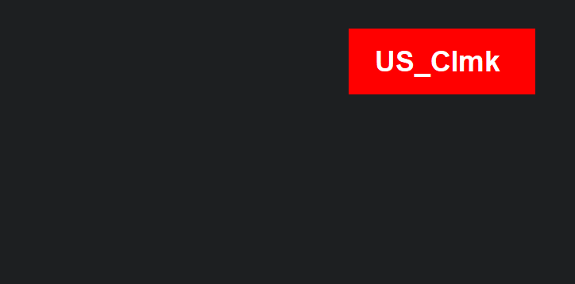

# 🔤 Keyboard Layout Indicator (AutoHotkey v1)

> `ShowKeyboardLayout.ahk`

A lightweight, floating GUI script that **displays your current keyboard layout** in real time, with **custom colors** per layout. Built in AutoHotkey v1.

Ideal for:

- Keyboard layout switchers (e.g. QWERTY, Colemak, Dvorak, etc.)
- Multilingual typists
- Anyone who wants a visual layout reminder always on screen

---

## ✨ Features

- 🔄 Auto-updates every 500ms to reflect the current layout
- 🎨 Color-coded text and background based on layout
- 🖼️ Always-on-top floating GUI (no taskbar icon)
- ⌨️ Toggle GUI visibility with `F8`
- 🚀 Option to autostart with Windows (adds shortcut to Startup folder)

---

## 💻 Supported Layouts (customizable)

Sometimes the native layout code is different, in that case, you'll see the raw code instead of the abbreviation or name defined.

> Simply copy the displayed code into the **_map_**.

| Layout Code | Label     | Background | Text Color |
| ----------- | --------- | ---------- | ---------- |
| `F0010409`  | US_Int    | Black      | White      |
| `F0D30409`  | US_Clmk   | Red        | White      |
| `080A580A`  | Spa_LA    | Gray       | White      |
| `08040804`  | Chn_Simpl | Black      | Gray       |

> You can add more layouts or customize labels/colors in the `layoutMap` inside the script.

---

## 🚀 Getting Started

### ✅ Requirements

- [AutoHotkey v1.x](https://www.autohotkey.com/) (not v2)

### 🧠 How to Use

1. **Clone or download** the repo
2. Open the script with AutoHotkey
3. Switch keyboard layouts — watch the floating label update instantly!

#### To toggle the GUI display:

> Press `F8`

#### To enable autostart:

Uncomment the following line in the script to create a startup shortcut:

```ahk
FileCreateShortcut, %A_ScriptFullPath%, %A_Startup%\%A_ScriptName%.lnk, %A_ScriptDir%
```

### 🛠 Customization

- Add new layouts:

  > Edit the layoutMap dictionary in the script.

- Change font, position, size:

  > Look inside the `CreateGui()` function.
  >
  > > Change position via the `Gui, Show, x10 y10` line.
  > > Adjust font, size, or color via `Gui, Font` and `Gui, Add`.

- Modify colors or text per layout:
  > Tweak `textColor` and `bgColor` in the map.

### 📸 Screenshot



### 🧾 License

MIT — do what you like with it!
